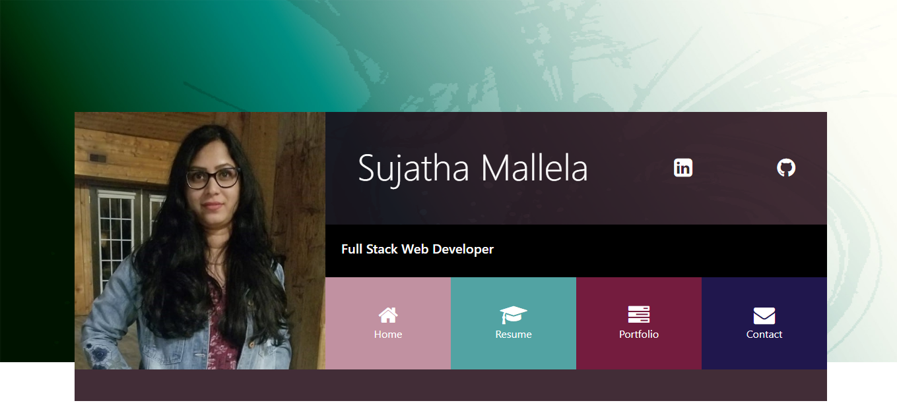
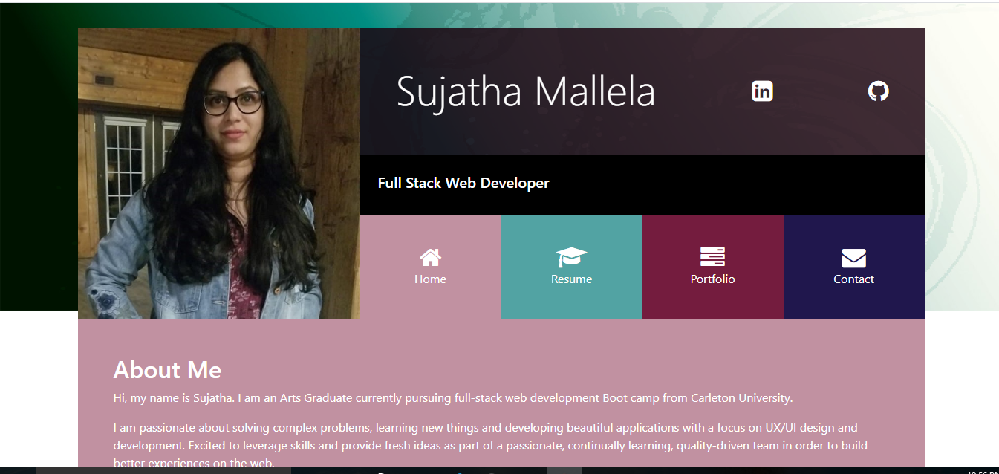
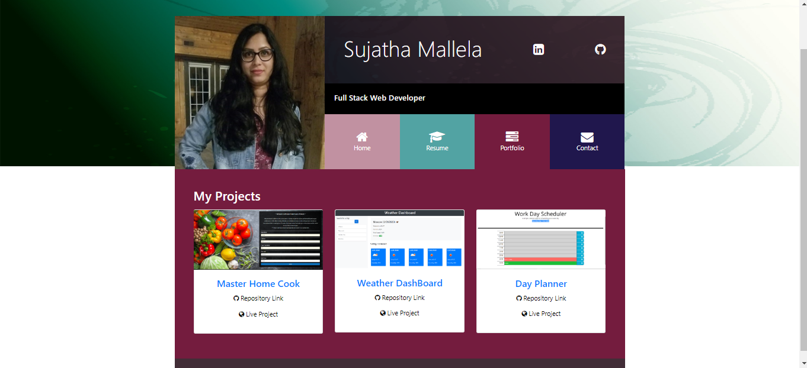
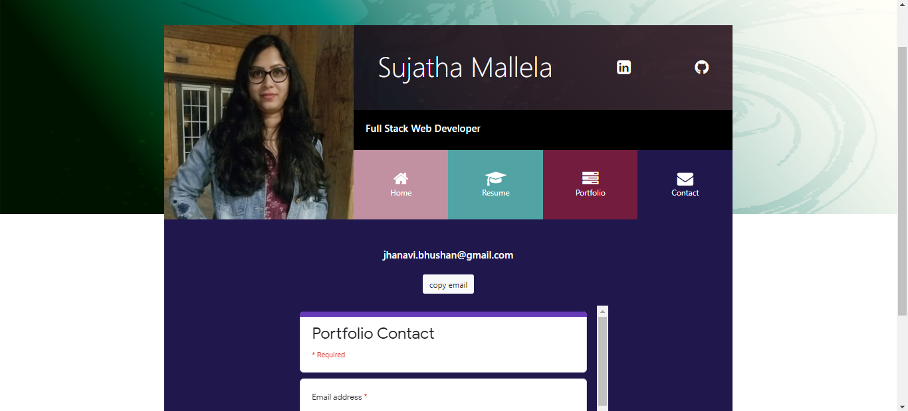

# Portfoliov2.0

**Deployed Web URL**
https://sujatha-m.github.io/Portfoliov2.0/

Updated portfolio page using HTML, CSS, Bootstrap, & JavaScript. Features mobile responsive.

## Description

My updated portfolio includes links to my GitHub & LinkedIn profile page, as well as my email address. Additionally, I have included a list of projects, which can be found here. For each project I have included a link to a deployed version and to my GitHub repository.

This is a build-in-progress portfolio that will ultimately showcase my work as a Full Stack Software Developer

The portfolio will look like the images below:

